  

<h1 align="center">Hi, I'm Wassim Afouss 👋</h1>

<h3 align="center">Full Stack Developer | Computer Science Student 🎓💻</h3>

  I enjoy building clean, useful, and scalable web experiences with modern full stack tools.
   
  Always learning, always shipping, and always improving one commit at a time.

  
  
  

  

---

<h2 align="center">🛠️ Tech Stack</h2>

<h3 align="center">Programming Languages</h3>

  
  
  
  

<h3 align="center">Frontend</h3>

  
  
  
  

<h3 align="center">Backend</h3>

  
  

<h3 align="center">DevOps & Tools</h3>

  
  
  

---

<h2 align="center">📊 GitHub Stats</h2>

  
  

  

---

<h2 align="center">🐍 Contribution Graph</h2>

  <picture>
    <source media="(prefers-color-scheme: dark)" srcset="https://raw.githubusercontent.com/Afousswassim/Afousswassim/output/github-contribution-grid-snake-dark.svg" />
    <source media="(prefers-color-scheme: light)" srcset="https://raw.githubusercontent.com/Afousswassim/Afousswassim/output/github-contribution-grid-snake.svg" />
    
  </picture>

---

  

  <b>Thanks for visiting my profile. Let's build something great. 🚀</b>

